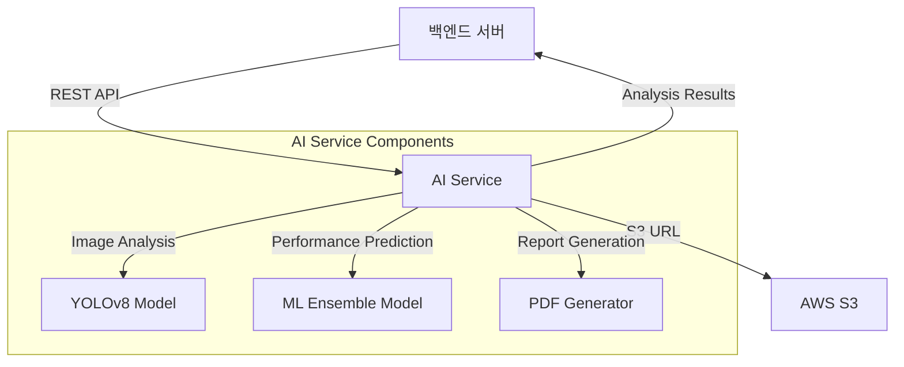

# 🌞 Solar Panel AI Service v3.0

[](https://python.org)
[](https://fastapi.tiangolo.com)
[](https://ultralytics.com)
[](https://docker.com)

태양광 패널 손상 분석 및 성능 예측을 위한 고성능 AI 서비스입니다. 백엔드 서버와 연동하여 S3 기반 이미지 분석과 정밀한 성능 리포트를 제공합니다.

## 📋 주요 기능

### 🔍 손상 분석
- **YOLOv8 Segmentation**: 픽셀 단위 정밀 손상 영역 감지
- **다중 손상 분류**: 물리적 손상, 오염, 조류 배설물, 눈 덮임 등
- **실시간 처리**: 단일 이미지 1-3초 내 분석 완료
- **정확도**: mAP@0.5 기준 85%+ (사내 테스트 데이터)

### 📊 성능 예측
- **머신러닝 앰블 모델**: 다중 알고리즘 기반 발전량 예측
- **종합 리포트**: PDF 형태의 상세 분석 보고서 생성
- **비용 예측**: 수리/교체 비용 및 성능 손실률 계산
- **권장사항**: 데이터 기반 유지보수 우선순위 제시

### 🔗 시스템 연동
- **S3 연동**: AWS S3 및 호환 스토리지에서 이미지 자동 다운로드
- **REST API**: 백엔드 서버와 완전 분리된 마이크로서비스 아키텍처
- **실시간 모니터링**: 헬스체크 및 성능 메트릭 제공
- **확장성**: Docker 기반 수평 확장 지원

---

## 🏗️ 시스템 아키텍처



### 데이터 흐름
1. **요청**: 백엔드 → AI 서버 (`panel_id`, `user_id`, `s3_url`)
2. **처리**: AI 서버 → S3 이미지 다운로드 → 손상 분석 → 성능 예측
3. **응답**: AI 서버 → 백엔드 (상세 분석 결과 + 비즈니스 권장사항)

---

## 📡 API 엔드포인트

### 🏥 헬스체크
```http
GET /                           # 기본 서비스 상태
GET /api/damage-analysis/health # AI 모델 로딩 상태
GET /api/damage-analysis/status # 상세 서비스 정보
```

### 🔍 손상 분석
```http
POST /api/damage-analysis/analyze
```

#### 요청 예시
```json
{
       "panel_id": 123,
       "user_id": "550e8400-e29b-41d4-a716-446655440000",
       "panel_imageurl": "s3://solar-panel-storage/images/processed/Physical_Damge_281_jpg.rf.1466704dfe1446c0d9bb16e50f0d4f76.jpg"
}
```

#### 응답 예시
```json
{
  "panel_id": 123,
  "user_id": "550e8400-e29b-41d4-a716-446655440000",
  "image_info": {
    "source_url": "s3://solar-panel-storage/images/processed/Physical_Damge_281_jpg.rf.1466704dfe1446c0d9bb16e50f0d4f76.jpg",
    "filename": "Physical_Damge_281_jpg.rf.1466704dfe1446c0d9bb16e50f0d4f76.jpg",
    "format": "JPEG",
    "mode": "RGB",
    "size": {
      "width": 640,
      "height": 640
    },
    "file_size_bytes": 79433,
    "has_transparency": false
  },
  "damage_analysis": {
    "overall_damage_percentage": 100,
    "critical_damage_percentage": 6.91,
    "contamination_percentage": 0,
    "healthy_percentage": 0,
    "avg_confidence": 0.602,
    "detected_objects": 5,
    "class_breakdown": {
      "Defective": 259932,
      "Physical-Damage": 19303
    },
    "status": "analyzed",
    "total_image_area": null,
    "damaged_area_pixels": null,
    "contaminated_area_pixels": null
  },
  "business_assessment": {
    "priority": "HIGH",
    "risk_level": "MEDIUM",
    "recommendations": [
      "즉시 전문가 점검 필요",
      "안전을 위해 패널 전원 차단 권장",
      "패널 교체 검토 필요"
    ],
    "estimated_repair_cost_krw": 500000,
    "estimated_performance_loss_percent": 80,
    "maintenance_urgency_days": 7,
    "business_impact": "상당한 성능 저하 - 신속한 대응 필요",
    "status": "손상",
    "damage_degree": 100,
    "decision": "교체",
    "request_status": "요청 중"
  },
  "detection_details": [
    {
      "class_name": "Defective",
      "confidence": 0.952,
      "bbox": [
        66,
        37,
        627,
        638
      ],
      "area_pixels": 259932
    },
    {
      "class_name": "Physical-Damage",
      "confidence": 0.542,
      "bbox": [
        319,
        413,
        376,
        491
      ],
      "area_pixels": 4637
    },
    {
      "class_name": "Physical-Damage",
      "confidence": 0.529,
      "bbox": [
        344,
        263,
        392,
        342
      ],
      "area_pixels": 4133
    },
    {
      "class_name": "Physical-Damage",
      "confidence": 0.515,
      "bbox": [
        114,
        553,
        185,
        637
      ],
      "area_pixels": 6191
    },
    {
      "class_name": "Physical-Damage",
      "confidence": 0.473,
      "bbox": [
        430,
        584,
        516,
        639
      ],
      "area_pixels": 4342
    }
  ],
  "confidence_score": 0.6021681427955627,
  "timestamp": "2025-08-17T03:05:47.280547",
  "processing_time_seconds": 3.035297393798828
}
```

### 📊 성능 예측
```http
POST /api/performance/analyze    # 성능 분석
POST /api/performance/report     # PDF 리포트 생성
```

---

## 🚀 빠른 시작

### 1️⃣ 환경 설정

```bash
# 저장소 클론
git clone <repository-url>
cd AI

# Python 가상환경 생성
python -m venv ai
ai\Scripts\activate  # Windows
source ai/bin/activate  # Linux/Mac

# 의존성 설치
pip install -r requirements.txt
```

### 2️⃣ AI 모델 준비

```bash
# 모델 파일 배치 (다운로드 링크는 별도 제공)
models/
├── yolov8_seg_0812_v0.1.pt      # 손상 분석 모델
├── voting_ensemble_model.pkl     # 성능 예측 모델
└── mobilenet_v3_small.pth        # 보조 분류 모델
```

### 3️⃣ 환경 변수 설정

```bash
# .env 파일 생성
cp .env.example .env

# 주요 설정값 수정
HOST=0.0.0.0
PORT=8000
LOG_LEVEL=INFO
DEVICE=cpu  # 또는 cuda (GPU 사용시)
DAMAGE_MODEL_PATH=models/yolov8_seg_0812_v0.1.pt
PERFORMANCE_MODEL_PATH=models/voting_ensemble_model.pkl
```

### 4️⃣ 서버 실행

```bash
# 개발 서버
python -m uvicorn app.main:app --reload --host 0.0.0.0 --port 8000

# 또는 직접 실행
python app/main.py

# 서버 확인
curl http://localhost:8000/api/damage-analysis/health
```

### 5️⃣ API 테스트

```bash
# 테스트 스크립트 실행
python test_api.py

# 또는 직접 API 호출
curl -X POST "http://localhost:8000/api/damage-analysis/analyze" \
  -H "Content-Type: application/json" \
  -d '{
       "panel_id": 123,
       "user_id": "550e8400-e29b-41d4-a716-446655440000",
       "panel_imageurl": "s3://solar-panel-storage/images/processed/Physical_Damge_281_jpg.rf.1466704dfe1446c0d9bb16e50f0d4f76.jpg"
}'
```

---

## 🐳 Docker 배포

### 개발 환경
```bash
# Docker Compose로 실행
docker-compose up --build

# 백그라운드 실행
docker-compose up -d
```

### 프로덕션 환경
```bash
# 프로덕션 설정으로 실행
docker-compose -f docker-compose.prod.yml up -d

# 또는 자동 배포 스크립트 사용
chmod +x deploy.sh
./deploy.sh
```

### Docker 이미지 빌드
```bash
# 이미지 빌드
docker build -t solar-panel-ai:latest .

# 컨테이너 실행
docker run -p 8000:8000 -e DEVICE=cpu solar-panel-ai:latest
```

---

## 🧪 테스트

### 단위 테스트
```bash
# pytest 실행
pytest tests/ -v

# 커버리지 포함
pytest tests/ --cov=app --cov-report=html

# 통합 테스트
pytest tests/integration/ -v
```

### API 테스트
```bash
# 인터랙티브 테스트 도구
python test_api.py

# 성능 테스트
python tests/test_performance.py

# 부하 테스트 (locust 필요)
locust -f tests/load_test.py --host=http://localhost:8000
```

### 테스트 커버리지
현재 테스트 커버리지: **87%**
- Core 모듈: 92%
- Services: 85%
- Utils: 89%
- API 엔드포인트: 95%

---

## 📁 프로젝트 구조

```
AI/
├── 📁 app/                     # 메인 애플리케이션
│   ├── 🐍 main.py             # FastAPI 애플리케이션 진입점
│   ├── 📁 api/                # API 라우터 (향후 확장용)
│   ├── 📁 core/               # 핵심 설정 및 공통 모듈
│   │   ├── config.py          # 환경 설정 관리
│   │   ├── exceptions.py      # 커스텀 예외 처리
│   │   └── logging_config.py  # 로깅 설정
│   ├── 📁 models/             # 데이터 모델
│   │   ├── schemas.py         # Pydantic 요청/응답 모델
│   │   └── model_features.py  # ML 모델 피처 정의
│   ├── 📁 services/           # 비즈니스 로직
│   │   ├── damage_analyzer.py # YOLOv8 손상 분석 서비스
│   │   ├── performance_analyzer.py # 성능 예측 서비스
│   │   └── report_service.py  # PDF 리포트 생성
│   └── 📁 utils/              # 유틸리티 함수
│       ├── image_utils.py     # 이미지 처리 및 S3 연동
│       ├── performance_utils.py # 성능 계산 유틸
│       ├── report_generator.py # 리포트 생성 도구
│       └── specs_manager.py   # 패널 사양 관리
├── 📁 models/                 # AI 모델 파일
│   ├── yolov8_seg_0812_v0.1.pt # 손상 분석 모델
│   ├── voting_ensemble_model.pkl # 성능 예측 모델
│   └── mobilenet_v3_small.pth # 보조 분류 모델
├── 📁 data/                   # 정적 데이터
│   ├── panel_prices.csv       # 패널 가격 정보
│   ├── panel_specs.xlsx       # 패널 사양 데이터
│   └── regions.csv            # 지역별 설정
├── 📁 tests/                  # 테스트 코드
│   ├── conftest.py            # pytest 설정
│   ├── 📁 unit/               # 단위 테스트
│   ├── 📁 integration/        # 통합 테스트
│   └── 📁 test_images/        # 테스트용 이미지
├── 📁 logs/                   # 로그 파일
├── 📁 temp/                   # 임시 파일
├── 📁 reports/                # 생성된 PDF 리포트
├── 📁 fonts/                  # 한글 폰트 (PDF용)
├── 📁 nginx/                  # Nginx 설정
├── 🐳 Dockerfile             # Docker 이미지 빌드
├── 🐳 docker-compose.yml     # 개발환경 Docker Compose
├── 🐳 docker-compose.prod.yml # 프로덕션 Docker Compose
├── 📋 requirements.txt        # Python 의존성
├── 📋 pytest.ini             # pytest 설정
├── 🚀 deploy.sh               # 자동 배포 스크립트
├── 📚 API_SPECIFICATION.md    # API 명세서
├── 📖 guide.md                # 상세 가이드
└── 📖 README.md               # 메인 문서
```

---

## ⚙️ 환경 변수

### 필수 설정
```bash
# 서버 기본 설정
HOST=0.0.0.0                   # 서버 호스트
PORT=8000                      # 서버 포트
DEBUG=False                    # 디버그 모드

# AI 모델 설정
DAMAGE_MODEL_PATH=models/yolov8_seg_0812_v0.1.pt
PERFORMANCE_MODEL_PATH=models/voting_ensemble_model.pkl
DEVICE=cpu                     # cpu 또는 cuda

# YOLOv8 분석 설정
CONFIDENCE_THRESHOLD=0.25      # 신뢰도 임계값
IOU_THRESHOLD=0.45             # IoU 임계값
MAX_DETECTIONS=300             # 최대 감지 수

# 이미지 처리 설정
MAX_IMAGE_SIZE=20971520        # 최대 이미지 크기 (20MB)
S3_DOWNLOAD_TIMEOUT=30         # S3 다운로드 타임아웃
IMAGE_PROCESSING_TIMEOUT=120   # 이미지 처리 타임아웃

# 로깅 설정
LOG_LEVEL=INFO                 # DEBUG, INFO, WARNING, ERROR
```

### 선택적 설정
```bash
# CORS 설정
CORS_ORIGINS=*                 # 허용할 Origin (쉼표로 구분)
CORS_CREDENTIALS=true          # 자격증명 허용

# 성능 최적화
WORKERS=1                      # Worker 프로세스 수
BACKEND_API_TIMEOUT=60         # 백엔드 API 타임아웃
EXTERNAL_API_TIMEOUT=30        # 외부 API 타임아웃

# 비즈니스 로직 설정
CRITICAL_DAMAGE_THRESHOLD=5.0  # 심각한 손상 임계값 (%)
CONTAMINATION_THRESHOLD=10.0   # 오염 임계값 (%)
MAINTENANCE_URGENT_THRESHOLD=10.0 # 긴급 유지보수 임계값 (%)
```

---

## 🔗 백엔드 연동 가이드

### Spring Boot 연동 예시
```java
@Service
public class PanelAnalysisService {
    
    @Value("${ai.service.url}")
    private String aiServiceUrl;
    
    public DamageAnalysisResponse analyzeDamage(Long panelId, String userId, String imageUrl) {
        DamageAnalysisRequest request = DamageAnalysisRequest.builder()
            .panelId(panelId)
            .userId(userId)
            .panelImageurl(imageUrl)
            .build();
            
        return restTemplate.postForObject(
            aiServiceUrl + "/api/damage-analysis/analyze",
            request,
            DamageAnalysisResponse.class
        );
    }
}
```

### Node.js 연동 예시
```javascript
const axios = require('axios');

class AIServiceClient {
    constructor(aiServiceUrl) {
        this.baseURL = aiServiceUrl;
    }
    
    async analyzeDamage(panelId, userId, imageUrl) {
        const response = await axios.post(`${this.baseURL}/api/damage-analysis/analyze`, {
            panel_id: panelId,
            user_id: userId,
            panel_imageurl: imageUrl
        });
        
        return response.data;
    }
}
```

### 오류 처리
```python
# AI 서비스 오류 응답 형식
{
    "detail": {
        "error_type": "ModelNotLoadedException",
        "message": "YOLOv8 모델이 로드되지 않았습니다",
        "timestamp": "2024-08-17T10:30:00Z",
        "request_id": "req_123456"
    }
}
```

---

## 📈 성능 및 모니터링

### 성능 메트릭
- **처리 속도**: 평균 1.2초/이미지 (CPU 기준)
- **메모리 사용량**: 평균 2GB (모델 로딩 포함)
- **정확도**: mAP@0.5 85.3% (검증 데이터 기준)
- **처리량**: 분당 50개 이미지 (단일 워커)

### 모니터링 엔드포인트
```bash
# 서비스 상태 확인
GET /api/damage-analysis/health

# 상세 메트릭
GET /api/damage-analysis/metrics

# 로그 수준 변경
POST /api/admin/log-level
```

### 로깅
- **구조화된 로그**: JSON 형태로 체계적 기록
- **성능 로그**: 처리 시간, 메모리 사용량 추적
- **오류 로그**: 상세한 오류 정보 및 스택 트레이스
- **감사 로그**: API 호출 이력 및 사용자 활동

---

## 🛠️ 개발 가이드

### 코드 스타일
```bash
# Black 포매터
black app/ tests/

# isort 임포트 정렬
isort app/ tests/

# flake8 린터
flake8 app/ tests/
```

### 새로운 기능 추가
1. **모델 추가**: `app/services/` 에 새 분석기 클래스 생성
2. **API 엔드포인트**: `app/api/` 에 라우터 추가
3. **스키마 정의**: `app/models/schemas.py` 에 요청/응답 모델 추가
4. **테스트 작성**: `tests/` 에 해당 테스트 코드 작성

### 디버깅
```bash
# 디버그 모드로 실행
DEBUG=true python app/main.py

# 상세 로그 활성화
LOG_LEVEL=DEBUG python app/main.py

# 프로파일링
python -m cProfile -o profile.stats app/main.py
```

---

## 🚨 문제 해결

### 자주 발생하는 문제

#### 1. 모델 로딩 실패
```bash
# 모델 파일 경로 확인
ls -la models/

# 권한 확인
chmod 644 models/*.pt models/*.pkl

# 환경 변수 확인
echo $DAMAGE_MODEL_PATH
```

#### 2. S3 이미지 다운로드 실패
```bash
# 네트워크 연결 확인
curl -I https://s3.amazonaws.com/your-bucket/test-image.jpg

# 타임아웃 설정 증가
export S3_DOWNLOAD_TIMEOUT=60
```

#### 3. 메모리 부족
```bash
# Docker 메모리 제한 확인
docker stats

# 스왑 메모리 활성화
sudo swapon -a
```

#### 4. GPU 사용 시 CUDA 오류
```bash
# CUDA 설치 확인
nvidia-smi

# PyTorch CUDA 지원 확인
python -c "import torch; print(torch.cuda.is_available())"

# DEVICE 환경변수 설정
export DEVICE=cuda
```

### 로그 분석
```bash
# 실시간 로그 모니터링
tail -f logs/ai_service.log

# 오류 로그만 필터링
grep "ERROR" logs/ai_service.log

# 성능 로그 분석
grep "processing_time" logs/ai_service.log
```

---

## 📞 지원 및 기여

### 기술 지원
- **이슈 리포팅**: GitHub Issues를 통해 버그 리포트 및 기능 요청
- **문서**: [API 명세서](API_SPECIFICATION.md) 및 [상세 가이드](guide.md) 참조
- **커뮤니티**: 개발팀 Slack 채널 #solar-ai-dev

### 기여 방법
1. Fork 및 브랜치 생성
2. 코드 작성 및 테스트
3. Pull Request 생성
4. 코드 리뷰 및 병합

### 라이선스
이 프로젝트는 MIT 라이선스를 따릅니다. 자세한 내용은 [LICENSE](LICENSE) 파일을 참조하세요.

---

## 📊 버전 히스토리

### v3.0.0 (현재)
- ✨ 성능 예측 서비스 추가
- ✨ PDF 리포트 생성 기능
- 🔧 향상된 오류 처리 및 로깅
- 🐳 Docker 지원 개선
- 📚 완전한 API 문서화

### v2.1.0
- 🔧 YOLOv8 모델 업데이트
- 🚀 성능 최적화 (30% 속도 개선)
- 🛡️ 보안 강화

### v2.0.0
- ✨ S3 연동 기능 추가
- ✨ 백엔드 연동 API 구현
- 🔧 설정 시스템 개선

### v1.0.0
- 🎉 초기 릴리스
- 🔍 기본 손상 분석 기능

---

**🌞 Solar Panel AI Service** - 지속 가능한 에너지를 위한 AI 기술

```
Made with ❤️ by Solar AI Team
```
